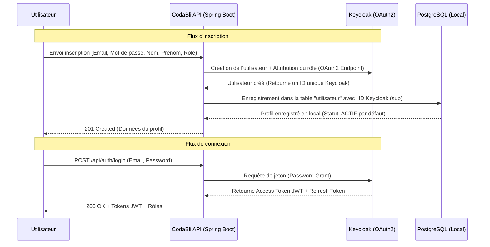
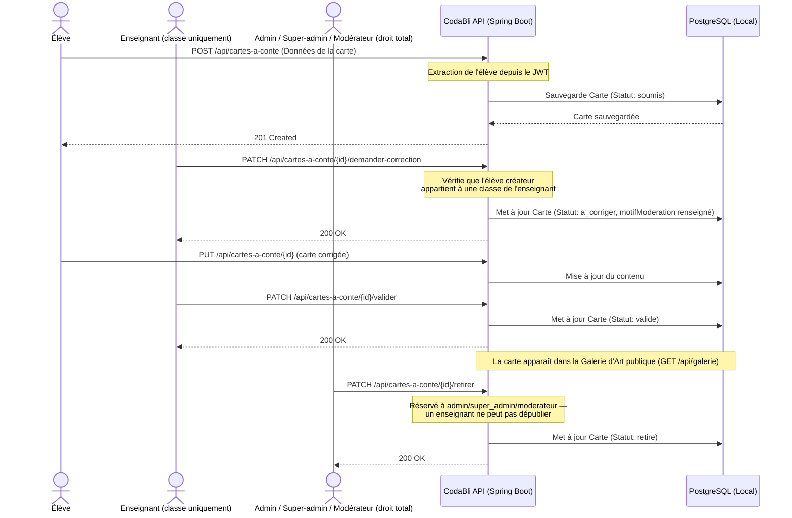
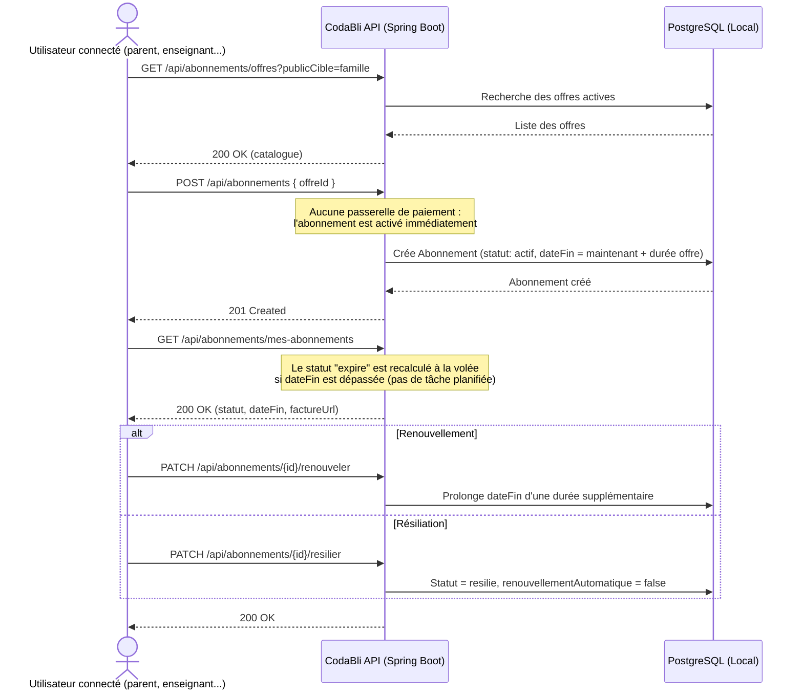
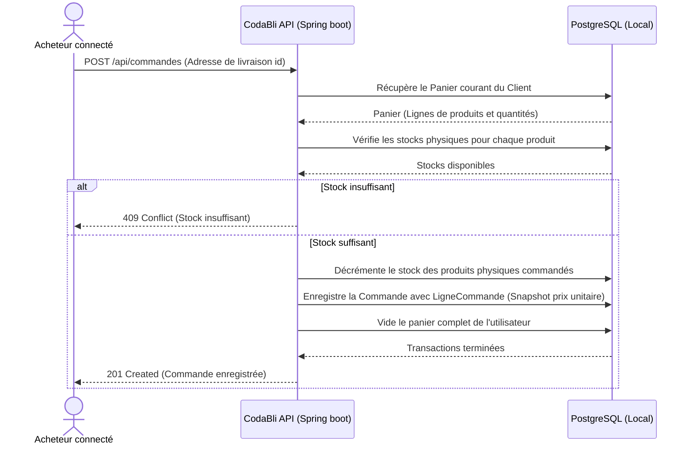
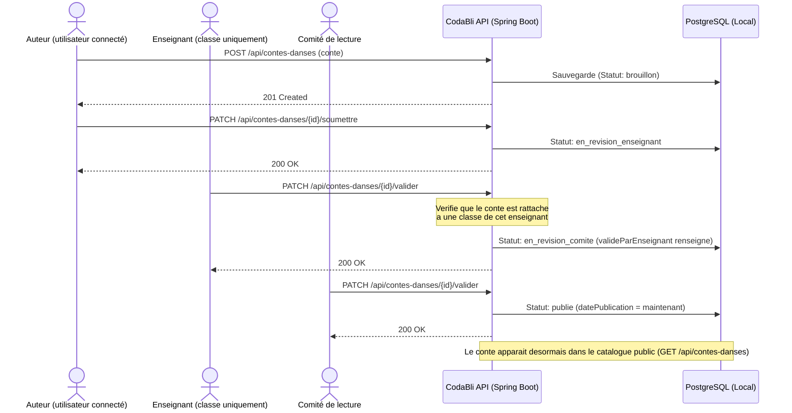
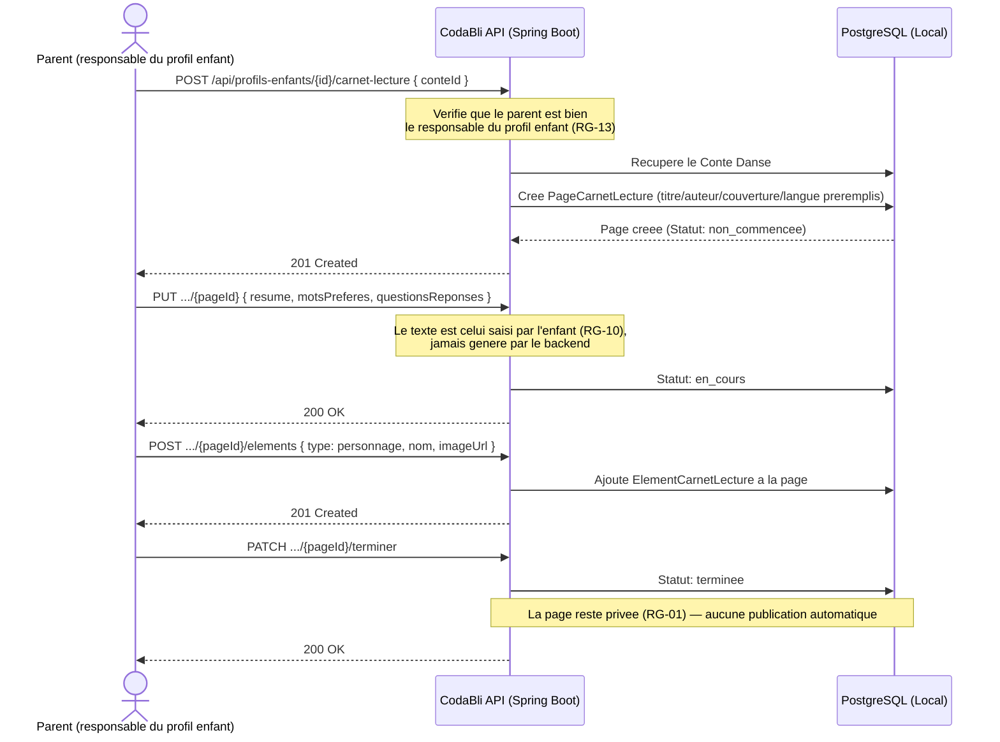

# Guide Fonctionnel Détaillé - Codabli Backend

Ce guide décrit en détail le fonctionnement métier, les flux d'exécution techniques et les interactions entre les différents modules du backend **Codabli**.

---

## 🔐 1. Authentification, Synchronisation & Rôles
Le cycle d'authentification et de gestion des identités est co-géré par le serveur d'autorisation **Keycloak** (Realm `codabli`) et la base de données PostgreSQL de l'application.

* **Création de l'Utilisateur** : Le mot de passe de l'utilisateur n'est jamais stocké dans la base PostgreSQL locale de l'application. Il réside exclusivement et de manière sécurisée dans Keycloak. L'entité locale `Utilisateur` sert uniquement à stocker les informations métiers (comme la date de naissance, la langue préférée et la relation à son école) et à lier les données locales (commandes, panier, cartes, abonnements, profils enfants...).
* **Inscription (`POST /api/auth/register`)** : Crée l'utilisateur dans Keycloak, lui attribue son rôle par défaut, puis l'enregistre en local avec l'identifiant unique Keycloak (champ `sub` du JWT). Par défaut, le compte est créé avec le statut `ACTIF`.
  * **Exemple de Requête JSON** :
    ```json
    {
      "nom": "Dupont",
      "prenom": "Jean",
      "email": "jean.dupont@example.com",
      "password": "Password123!",
      "role": "enseignant",
      "dateNaissance": "1985-05-15",
      "ecoleId": "3fa85f64-5717-4562-b3fc-2c963f66afa6",
      "languePreferee": "fr"
    }
    ```
* **Connexion (`POST /api/auth/login`)** : Valide les identifiants de l'utilisateur au niveau de Keycloak et renvoie ses tokens OAuth2 (Access Token JWT et Refresh Token).
  * **Exemple de Requête JSON** :
    ```json
    {
      "email": "jean.dupont@example.com",
      "password": "Password123!"
    }
    ```
* **Gestion du profil (`/me`)** : L'utilisateur connecté peut lire (`GET /api/auth/me`) ou mettre à jour (`PUT /api/auth/me`) son profil local en fournissant son token JWT dans les en-têtes de la requête.
  * **Exemple de Requête JSON (`PUT`)** :
    ```json
    {
      "nom": "Dupont Modifié",
      "prenom": "Jean-Pierre",
      "dateNaissance": "1985-05-16",
      "languePreferee": "en"
    }
    ```
* **Modération du statut** : Un administrateur peut modifier le statut d'un compte utilisateur (`ACTIF` ➡️ `SUSPENDU` ou `INACTIF`) via l'API d'administration `PATCH /api/admin/utilisateurs/{id}/statut` afin de lui restreindre l'accès à l'application sans détruire ses données historiques.
  * **Exemple de Requête JSON** :
    ```json
    {
      "statut": "inactif"
    }
    ```
* **Rôles disponibles** : `eleve`, `enseignant`, `parent`, `professionnel_education`, `moderateur`, `admin`, `super_admin`, `comite_lecture`, `traducteur`, `ambassadeur`.
  * `admin` et `super_admin` disposent tous deux d'un **droit total** sur la modération des contenus (cartes à conte, contes dansés, traductions). `super_admin` a en plus accès à l'intégralité des routes `/api/admin/**`.
  * `moderateur` est un rôle dédié à la modération des créations (cartes à conte) sans les autres prérogatives d'administration.
  * `traducteur` et `comite_lecture` gèrent le cycle de traduction des Contes Dansés (avec `admin`/`super_admin`).
  * `parent` et `professionnel_education` peuvent créer et gérer des **profils enfants**.

---

## 🏫 2. Cycle de Vie Scolaire (Écoles, Classes & Inscriptions)
Ce module gère le rattachement hiérarchique permettant de lier les élèves à des entités éducatives.

* **Création d'une École (`POST /api/ecoles`)** : Enregistrement de l'établissement avec ses informations de localisation (adresse, code postal et ville).
  * **Exemple de Requête JSON** :
    ```json
    {
      "nom": "École Primaire du Centre",
      "pays": "France",
      "ville": "Paris"
    }
    ```
* **Création d'une Classe (`POST /api/classes`)** : Une classe est créée en étant liée à une école existante. Lors de sa création, le système génère systématiquement un **code d'invitation unique** (chaîne aléatoire).
  * **Exemple de Requête JSON** :
    ```json
    {
      "ecoleId": "3fa85f64-5717-4562-b3fc-2c963f66afa6",
      "enseignantId": "4ba95f64-5717-4562-b3fc-2c963f66bfa7",
      "nom": "CM2-A",
      "niveau": "CM2",
      "anneeScolaire": "2026-2027"
    }
    ```
* **Liaison d'un élève à sa classe (`POST /api/inscriptions-classes`)** :
  1. L'élève se connecte avec son jeton JWT.
  2. Il transmet son code d'invitation de classe.
  3. L'application recherche la classe associée au code, vérifie l'absence d'inscription active antérieure pour cet élève, puis l'inscrit dans la table `InscriptionClasse` à la date actuelle.
  * **Exemple de Requête JSON** :
    ```json
    {
      "eleveId": "5ca95f64-5717-4562-b3fc-2c963f66cfa8",
      "classeId": "6da95f64-5717-4562-b3fc-2c963f66dfa9"
    }
    ```

---

## 📖 3. Contes Dansés
Les contes dansés constituent le cœur de la bibliothèque culturelle de l'écosystème Codabli.

* **Création** : Tout utilisateur connecté peut proposer ou créer un conte (`POST /api/contes-danses`). Le conte est initialisé en mode `brouillon`.
  * **Exemple de Requête JSON** :
    ```json
    {
      "titre": "La Danse des Étoiles",
      "description": "Un conte féerique sur une constellation égarée.",
      "thematique": "Astrologie",
      "langueOriginale": "fr",
      "couvertureUrl": "https://storage.googleapis.com/codabli-contes/danse_etoiles_cover.jpg",
      "pays": "France",
      "culture": "Francophone",
      "ageMin": 6,
      "ageMax": 9,
      "dureeMinutes": 12,
      "credits": "Auteur : Hayat Harchi — Illustrateur : Studio Codabli",
      "fichierTexteUrl": "https://storage.googleapis.com/codabli-contes/danse_etoiles.txt",
      "fichierAudioUrl": "https://storage.googleapis.com/codabli-contes/danse_etoiles.mp3",
      "fichierVideoUrl": "https://storage.googleapis.com/codabli-contes/danse_etoiles.mp4",
      "ecoleId": "3fa85f64-5717-4562-b3fc-2c963f66afa6",
      "classeId": "6da95f64-5717-4562-b3fc-2c963f66dfa9"
    }
    ```
* **Cycle de validation (workflow complet)** :
  1. `PATCH /api/contes-danses/{id}/soumettre` — l'auteur soumet son `brouillon` (ou son conte `refuse` corrigé) → `en_revision_enseignant`.
  2. `PATCH /api/contes-danses/{id}/valider` — un enseignant (limité aux contes de ses propres classes) fait passer le conte en `en_revision_comite`.
  3. `PATCH /api/contes-danses/{id}/valider` — un membre du `comite_lecture` publie le conte → `publie` (`datePublication` renseignée).
  4. `admin`/`super_admin` disposent d'un droit total : `valider` publie directement depuis n'importe quel statut.
  5. `PATCH /api/contes-danses/{id}/refuser` — possible à toute étape par un rôle habilité, corps optionnel `{ "motif": "..." }` (conservé dans `motifModeration`).
  * `GET /api/contes-danses/mes-contes` : l'auteur retrouve tous ses contes quel que soit leur statut.
  * `GET /api/contes-danses/en-attente` : file d'attente filtrée par rôle (enseignant → ses classes ; comité de lecture → `en_revision_comite` ; admin/super_admin → tout ce qui est en révision).
* **Accessibilité publique** : Seuls les contes possédant le statut `publie` sont exposés aux visiteurs anonymes (`GET /api/contes-danses`).
* **Filtres du catalogue public (`GET /api/contes-danses`)** : le catalogue accepte des paramètres de requête optionnels, combinables, pour affiner la recherche :
  * `langue` (ex : `fr`), `pays` (ex : `Liban`), `thematique` (recherche partielle), `acces` (`gratuit` ou `payant`), `age` (retient les contes dont la tranche `ageMin`/`ageMax` couvre cet âge).
  * Exemple : `GET /api/contes-danses?pays=Liban&age=8&acces=gratuit`.
* **Gestion d'auteur** : Les modifications (`PUT /api/contes-danses/{id}`) et suppressions (`DELETE /api/contes-danses/{id}`) sont limitées à l'auteur original, ou à un `admin`/`super_admin`/`moderateur`.

---

## 🌍 4. Traductions des Contes Dansés (Multilingue)
Chaque Conte Dansé peut exister en plusieurs langues, chacune suivant son propre cycle de traduction/relecture/publication (`ConteDanseTraduction`).

* **Statuts** : `a_traduire` → `en_cours` → `relecture` → `validee` → `publiee` → `archivee`.
* **Règle clé (LAN-03)** : seule une traduction au statut `validee` (ou déjà `publiee`) peut passer à `publiee`. Toute tentative de publier une traduction non validée est rejetée (`400 Bad Request`).
* **Lecture publique (`GET /api/contes-danses/{conteId}/traductions`)** : ne retourne que les traductions **publiées**, c'est la liste des langues réellement disponibles pour les visiteurs.
* **Gestion (`GET /api/contes-danses/{conteId}/traductions/gestion`)** : réservée à `traducteur`, `comite_lecture`, `admin`, `super_admin` — retourne toutes les traductions quel que soit leur statut.
* **Créer une traduction (`POST /api/contes-danses/{conteId}/traductions`)** :
  ```json
  {
    "langue": "en",
    "variante": "UK",
    "texte": "Once upon a time, a lost constellation...",
    "audioUrl": "https://storage.googleapis.com/codabli-contes/danse_etoiles_en.mp3",
    "traducteurId": "1aa95f64-5717-4562-b3fc-2c963f66aaa1"
  }
  ```
* **Changer le statut (`PATCH /api/contes-danses/{conteId}/traductions/{id}/statut`)** :
  ```json
  { "statut": "validee" }
  ```
* **Suppression** : réservée à `comite_lecture`, `admin`, `super_admin`.

---

## 🃏 5. Cartes à Conte & Galerie d'Art
Il s'agit du parcours d'expression des élèves et de sa valorisation publique.

> ℹ️ Cette « Galerie d'Art » (vitrine des cartes à conte validées) est distincte de la **Galerie des Arts immersive** (section 23, `/api/galerie-arts`) qui organise les fresques culturelles par pays.

* **Création** : Un élève conçoit une scène et génère/soumet une carte (`POST /api/cartes-a-conte`). Le système extrait automatiquement son identifiant depuis le JWT pour l'enregistrer comme créateur de la carte. Celle-ci prend le statut **`soumis`**.
  * **Exemple de Requête JSON** :
    ```json
    {
      "type": "personnage",
      "imageUrl": "https://storage.googleapis.com/codabli-cartes/lutin.png",
      "texteAssocie": "Un lutin malicieux qui cherche ses clés.",
      "conteId": "7ea95f64-5717-4562-b3fc-2c963f66efa0"
    }
    ```
* **Statuts de modération complets (CDC 8.24)** : `brouillon`, `soumis`, `en_verification`, `a_corriger`, `valide`, `refuse`, `publie`, `retire`, `archive`.
* **Accessibilité restreinte (lecture)** :
  * Un élève ne liste que ses propres cartes.
  * Un enseignant du réseau scolaire ne voit que les cartes créées par les élèves inscrits dans ses classes.
  * `admin`, `super_admin` et `moderateur` voient **toutes** les cartes.
* **Cycle de modération complet** — quatre actions, avec la même règle de portée (enseignant limité à ses classes ; `admin`/`super_admin`/`moderateur` ont un droit total) :
  * `PATCH /api/cartes-a-conte/{id}/valider` → statut `valide`.
  * `PATCH /api/cartes-a-conte/{id}/refuser` → statut `refuse`. Corps optionnel : `{ "motif": "Contenu non conforme" }` (le motif est conservé dans `motifModeration`).
  * `PATCH /api/cartes-a-conte/{id}/demander-correction` → statut `a_corriger`, la carte revient au déposant. Corps optionnel : `{ "motif": "Merci de retirer le nom complet de l'élève" }`.
  * `PATCH /api/cartes-a-conte/{id}/retirer` → statut `retire` (dépublication d'une création déjà validée/publiée). **Réservé à `admin`/`super_admin`/`moderateur`** — un enseignant ne peut pas dépublier une création déjà validée.
* **Publication & Galerie d'Art (`GET /api/galerie`)** : Les cartes au statut `valide` entrent directement dans la Galerie d'Art publique.
* **Mise en Avant (`GalerieMiseEnAvant`)** : Les administrateurs peuvent ordonner la liste publique pour faire apparaître les cartes mises en avant en tête de liste, suivies des autres cartes validées (triées par date).
  * **Exemple de Requête JSON d'ajout en avant (`POST /api/admin/galerie/mise-en-avant`)** :
    ```json
    {
      "carteAConteId": "8fa95f64-5717-4562-b3fc-2c963f66ffa1",
      "dateFin": "2026-12-31T23:59:59Z",
      "ordreAffichage": 1
    }
    ```

---

## 📝 6. Fiches d'Activités Pédagogiques
Fiches structurées d'animation autour du Conte Dansé®, distinctes des ressources génériques de la Mallette Pédagogique.

* **Contenu d'une fiche** : Titre, Objectif, Tranche d'âge, Durée, Matériel, Consignes, Déroulement, Compétences visées, Adaptations (accessibilité), Crédits, et un lien vers le PDF téléchargeable.
* **Consultation (`GET /api/fiches-activites`)** : réservée à `enseignant`, `professionnel_education`, `admin`, `super_admin`, `comite_lecture`. Les rôles hors-gestion ne voient que les fiches actives (`actif = true`). Filtre optionnel `?age=8`.
* **Création/Modification (`POST` / `PUT`)** : réservées à `admin`, `super_admin`, `comite_lecture`.
  * **Exemple de Requête JSON (`POST`)** :
    ```json
    {
      "titre": "Danser les émotions du conte",
      "objectif": "Faire ressentir les émotions du récit par le mouvement",
      "ageMin": 6,
      "ageMax": 9,
      "dureeMinutes": 30,
      "materiel": "Un tapis de danse, une enceinte",
      "consignes": "Diviser la classe en petits groupes...",
      "deroulement": "1. Écoute du conte — 2. Choix d'une émotion — 3. Improvisation",
      "competences": "Expression corporelle, écoute active",
      "adaptations": "Version assise pour les enfants à mobilité réduite",
      "credits": "Conçu par le comité de lecture Codabli",
      "fichierPdfUrl": "https://storage.googleapis.com/codabli-fiches/danser-emotions.pdf",
      "actif": true
    }
    ```
* **Suppression (`DELETE`)** : réservée exclusivement à `admin`/`super_admin`.

---

## 🎒 7. Mallette Pédagogique (Ressources pour Enseignants)
Fournit une bibliothèque de ressources éducatives (fiches, guides de cours, podcasts, vidéos d'exercices) classées par type, thématique ou niveau scolaire.

* **Consultation (`GET`)** :
  * Accessible aux rôles : `enseignant`, `professionnel_education`, `admin` et `comite_lecture`.
  * **Pour les Enseignants & Éducateurs** : Un filtre de sécurité automatique est appliqué en base de données pour qu'ils n'obtiennent que les ressources actives (`actif = true`). Toute tentative de lecture directe (par ID) d'une ressource désactivée renvoie une erreur `AccessDeniedException` (HTTP 403).
  * **Pour les Administrateurs & Comités de lecture** : Ils peuvent consulter toutes les ressources y compris celles désactivées ou en préparation (`actif = false`).
* **Gestion (`POST`/`PUT`)** : La création (`POST /api/ressources-pedagogiques`) et la modification (`PUT /api/ressources-pedagogiques/{id}`) de ressources sont réservées au personnel d'encadrement pédagogique : les Administrateurs et le Comité de lecture.
  * **Exemple de Requête JSON (`POST`)** :
    ```json
    {
      "titre": "Fiche d'aide : La Danse des Oiseaux",
      "description": "Retrouvez les fiches d'exercices corporels associés au conte.",
      "type": "fiche",
      "fichierUrl": "https://storage.googleapis.com/codabli-pedagogique/danse_oiseaux.pdf",
      "thematique": "Faune & Mouvement",
      "niveauScolaire": "CM1",
      "actif": true
    }
    ```
* **Suppression (`DELETE /api/ressources-pedagogiques/{id}`)** : Action critique réservée exclusivement à l'Administrateur (interdite au comité de lecture).

---

## 🤝 8. Partenaires
Vitrine publique des partenaires de l'association Annaba Créative (institutionnels, fondations, culturels, associations, citoyens contributeurs).

* **Consultation publique (`GET /api/partenaires`)** : ne retourne que les partenaires actifs (`actif = true`). Filtre optionnel `?categorie=culturel`.
* **Détail (`GET /api/partenaires/{id}`)** : public.
* **Gestion (`POST`/`PUT`/`DELETE`)** : réservée à `admin`/`super_admin`.
  * **Exemple de Requête JSON (`POST`)** :
    ```json
    {
      "nom": "Institut Français de Beyrouth",
      "logoUrl": "https://storage.googleapis.com/codabli-partenaires/ifb.png",
      "presentation": "Partenaire culturel pour la salle Liban de la Galerie des Arts.",
      "categorie": "culturel",
      "territoire": "Liban",
      "roleProjet": "Fourniture de ressources culturelles et validation des contenus",
      "lien": "https://institutfrancais-liban.com",
      "periodeDebut": "2026-01-01",
      "actif": true
    }
    ```

---

## 💳 9. Abonnements
Catalogue d'offres géré par l'administration, et souscriptions des utilisateurs (familles, enseignants, établissements, structures).

* **Catalogue public (`GET /api/abonnements/offres`)** : liste les offres actives. Filtre optionnel `?publicCible=famille` (`famille`, `enseignant`, `etablissement`, `structure`).
* **Détail d'une offre** : `GET /api/abonnements/offres/{id}` — expose tarif, durée (`mensuel`/`annuel`), limites de profils/classes, stockage, accès webinaires/coaching/exports.
* **Gestion du catalogue (`/api/admin/abonnements/offres`)** : réservée à `admin`/`super_admin`.
  * **Exemple de Requête JSON (`POST`)** :
    ```json
    {
      "code": "famille_standard",
      "nom": "Famille Standard",
      "description": "Accès complet à la Mallette d'artistes pour un enfant",
      "publicCible": "famille",
      "tarif": 4.99,
      "duree": "mensuel",
      "limiteProfils": 1,
      "accesExports": true,
      "actif": true
    }
    ```
* **Souscrire (`POST /api/abonnements`)** : tout utilisateur authentifié peut souscrire à une offre active.
  ```json
  { "offreId": "2bb95f64-5717-4562-b3fc-2c963f66bbb2" }
  ```
  ⚠️ **Aucune passerelle de paiement n'est intégrée** (comme pour les `Commande` de la boutique) : la souscription **active immédiatement** l'abonnement (statut `actif`), sans étape de paiement réelle côté backend.
* **Mes abonnements (`GET /api/abonnements/mes-abonnements`)** : liste les souscriptions de l'utilisateur connecté, avec statut (`actif`/`expire`/`resilie` — l'expiration est recalculée à la volée à partir de `dateFin`, il n'y a pas de tâche planifiée), dates et `factureUrl` (simple lien vers un document externe, aucune génération PDF).
* **Renouveler / Résilier / Changer d'offre** :
  * `PATCH /api/abonnements/{id}/renouveler` — prolonge `dateFin` d'une durée supplémentaire.
  * `PATCH /api/abonnements/{id}/resilier` — statut `resilie`, désactive le renouvellement automatique.
  * `PATCH /api/abonnements/{id}/changer` — change d'offre, corps : `{ "offreId": "..." }`.
  * Ces trois actions sont réservées au propriétaire de l'abonnement (ou à `admin`/`super_admin`).

---

## 👶 10. Profils Enfants & Comptes Famille
Sous-profils légers rattachés au compte d'un adulte responsable (`parent` ou `professionnel_education`) — l'équivalent de « profils » gérés depuis un compte principal, **sans compte de connexion propre**.

> ℹ️ À ne pas confondre avec le rôle `eleve` : celui-ci reste un compte Keycloak complet, lié à une école, pour le workflow pédagogique (classes, modération des cartes). Le `ProfilEnfant` est un sous-profil de suivi/consultation géré par le responsable.

* **Créer un profil enfant (`POST /api/profils-enfants`)** : réservé à `parent`/`professionnel_education`.
  ```json
  {
    "pseudonyme": "Petit Lion",
    "dateNaissance": "2018-03-12",
    "languePreferee": "fr",
    "preferences": "Aime les contes d'animaux",
    "accessibilite": "Grands caractères recommandés",
    "autorisationParentale": true
  }
  ```
* **Règle RG-03 (identité)** : le champ exposé est le **pseudonyme**, jamais le nom complet.
* **Règle RG-04 (autorisation)** : `autorisationParentale` est horodatée automatiquement (`dateAutorisation`) dès qu'elle passe à `true`, et la date est effacée si elle est révoquée.
* **Mes profils (`GET /api/profils-enfants`)** : liste les profils du responsable connecté.
* **Détail / Modification / Suppression (`/{id}`)** : réservés au responsable propriétaire du profil, ou à `admin`/`super_admin`.
* **Confidentialité native** : ce backend simplifié ne crée pas de session indépendante pour l'enfant — il n'y a donc, par construction, aucun accès possible de l'enfant aux données du parent, aux paramètres du compte adulte ni aux fonctionnalités de paiement (RG-03).

---

## ✉️ 11. Contact
Formulaire de contact public.

* **Envoyer une demande (`POST /api/contact`)** : public, aucune authentification requise.
  ```json
  {
    "categorie": "partenariat",
    "nom": "Marie Curie",
    "email": "marie.curie@example.com",
    "sujet": "Proposition de partenariat culturel",
    "message": "Bonjour, notre association souhaiterait..."
  }
  ```
  La réponse inclut un `accuseReception` (texte de confirmation d'envoi).
  * Catégories disponibles : `information`, `abonnement`, `technique`, `boutique`, `commande`, `partenariat`, `presse`, `etablissement`, `donnees`, `signalement`.
* **Consultation (`GET /api/admin/contact`)** et **traitement (`PATCH /api/admin/contact/{id}/traiter`)** : réservés à `admin`/`super_admin`.

---

## 🛒 12. Boutique & E-Commerce (Panier, Commandes & Stocks)
Ce module fournit un cycle d'achat classique et robuste (Boutique de livres, objets culturels et contes numériques).

* **Gestion des Articles (`Produit`)** : Types de produits : Physique (ex: livre d'art, cartes physiques) ou Numérique (ex: conte audio téléchargeable). Seuls les produits physiques possèdent un attribut `stock` décrémentable.
* **Panier Personnel (`Panier` & `LignePanier`)** : Chaque panier est strictement privé. La base de données applique une contrainte d'unicité `(panier_id, produit_id)` afin d'éviter les doublons et incrémenter uniquement la quantité lors d'ajouts répétitifs.
  * **Ajout d'Article (`POST /api/panier/items`)** :
    ```json
    {
      "produitId": "9fa95f64-5717-4562-b3fc-2c963f66ffa2",
      "quantite": 2
    }
    ```
  * **Modification de Quantité (`PATCH /api/panier/items/{ligneId}`)** :
    ```json
    {
      "quantite": 5
    }
    ```
* **Processus de Commande (Checkout via `POST /api/commandes`)** :
  1. **Vérification du Stock** : Avant de valider l'achat, l'application bloque le processus si la quantité commandée pour un produit physique dépasse le stock restant (`409 Conflict`).
  2. **Décrémentation** : Diminue automatiquement le stock en base de données.
  3. **Snapshot Prix (Traçabilité Légale)** : Le prix courant du produit est copié dans la ligne de commande (`LigneCommande`). Le prix de la transaction historique est figé et indépendant des futures fluctuations tarifaires.
  4. **Nettoyage** : Le panier de l'utilisateur est entièrement vidé et réinitialisé.
  * **Exemple de Requête JSON** :
    ```json
    {
      "adresseLivraisonId": "0ba95f64-5717-4562-b3fc-2c963f66ffb3"
    }
    ```
* **Suivi Admin et Statut (`PATCH /api/admin/commandes/{id}/statut`)** : Les factures et expéditions sont gérées par les administrateurs via un changement d'état.
  * **Exemple de Requête JSON** :
    ```json
    {
      "statut": "payee"
    }
    ```

---

## 📰 13. Actualités (`/api/actualites`)
* **Accès Public** : Lecture des dernières actualités publiées pour toute la communauté.
* **Gestion** : Création (`POST /api/actualites`), modification (`PUT /api/actualites/{id}`) et suppression (`DELETE /api/actualites/{id}`) réservées aux administrateurs.
  * **Exemple de Requête JSON (`POST`)** :
    ```json
    {
      "titre": "Sortie de la nouvelle Mallette Pédagogique",
      "imageUrl": "https://storage.googleapis.com/codabli-news/newsletter_1.png",
      "resume": "Découvrez nos nouvelles fiches pédagogiques !",
      "contenu": "Nous avons ajouté plus de 20 fiches éducatives pour simplifier les cours.",
      "publie": true
    }
    ```

---

## 🔍 14. Recherche Globale Transversale (`GET /api/recherche?q=...`)
Un unique endpoint interroge simultanément **cinq** sources de contenus publics :

| Clé du résultat | Source | Filtre de visibilité appliqué |
|---|---|---|
| `actualites` | `Actualite` | `publie = true` |
| `contesDanses` | `ConteDanse` | `statut = publie` |
| `cartesAConte` | `CarteAConte` | `statutModeration = valide` (mêmes règles que la Galerie) |
| `produits` | `Produit` | `actif = true` |
| `partenaires` | `Partenaire` | `actif = true` |

La recherche est optimisée par des clauses `LIKE` insensibles à la casse sur les champs textuels pertinents (titre, résumé, texte associé, nom, description, présentation).

> ⚠️ Les **Ressources Pédagogiques** et **Fiches d'Activités** sont volontairement exclues de cette recherche publique : leur accès est réservé à certains rôles (`enseignant`, `professionnel_education`, `admin`, `comite_lecture`), et les inclure dans un endpoint public reviendrait à contourner cette restriction.

---

## 🧾 15. Journal d'Activité (`GET /api/admin/journal-activite`)
Historise les actions sensibles de l'administration (CDC 8.23, SUP-03). Réservé à `super_admin`.

* Actions actuellement tracées : `SUPPRESSION_UTILISATEUR`, `CHANGEMENT_STATUT_UTILISATEUR`, `ANONYMISATION_UTILISATEUR`, `RETRAIT_CARTE_A_CONTE`.
* Chaque entrée conserve : l'acteur (utilisateur connecté ayant déclenché l'action), l'action, la cible, un détail libre, et la date.
* Le service `JournalActiviteService.enregistrer(...)` peut être appelé depuis n'importe quel autre service pour tracer une nouvelle action sensible.

---

## 📔 16. Carnet de Lecture (`/api/profils-enfants/{profilEnfantId}/carnet-lecture`)
Espace créatif personnel de l'enfant : une page par conte lu (CDC 8.17.1, CDL-01 à 17).

* **Sécurité (RG-13)** : réservé au `responsable` (parent/professionnel_education) propriétaire du profil enfant, ou à `admin`/`super_admin`. Le `profilEnfantId` du chemin est systématiquement revérifié contre le JWT.
* **Créer une page (`POST .../carnet-lecture`)** — les métadonnées du conte sont préremplies si `conteId` est fourni, mais jamais le contenu personnel :
  ```json
  {
    "conteId": "66666666-6666-6666-6666-600000000001",
    "theme": "Amitié, courage",
    "resume": "L'histoire parle d'un lutin qui cherche ses clés magiques...",
    "motsPreferes": "constellation : un groupe d'étoiles qui dessine une forme",
    "questionsReponses": "Mon personnage préféré : le lutin, parce qu'il est drôle."
  }
  ```
* **Ajouter un élément (`POST .../{pageId}/elements`)** — personnage, lieu, objet magique ou création libre (dessin/collage/import), un seul type générique couvrant ces sous-listes du CDC :
  ```json
  { "type": "personnage", "nom": "Le Lutin", "description": "Il aime chercher des trésors.", "imageUrl": "https://.../dessin1.png" }
  ```
* **Cycle de vie de la page** : `non_commencee` → `en_cours` (dès la première modification) → `terminee` (`PATCH .../{pageId}/terminer`, CDL-15 — ne rend pas la page publique, RG-01) → `archivee`.
* **Carnet complet (`GET .../carnet-lecture`)** : toutes les pages de l'enfant (CDL-17).
* **Export (CDL-16)** : le champ `fichierExportUrl` référence un document externe ; aucune génération PDF côté backend (cohérent avec le reste du projet).

---

## 🧳 17. Carnet de Voyage (`/api/profils-enfants/{profilEnfantId}/carnet-voyage`)
Même principe que le Carnet de Lecture, associé à un pays/une fresque découverts (CDC 8.17.2, CDV-01 à 14).

* **Créer une page (`POST .../carnet-voyage`)** :
  ```json
  {
    "conteId": "66666666-6666-6666-6666-600000000002",
    "identiteNotes": "Le Liban est un pays au bord de la mer Méditerranée.",
    "natureNotes": "Il y a des montagnes et des cèdres.",
    "experienceNotes": "J'ai appris à dire bonjour en arabe : marhaba !"
  }
  ```
* **Éléments (`POST .../{pageId}/elements`)** : `element_naturel`, `element_culturel`, `personnage`, `objet` ou `creation`.
* Mêmes règles que le Carnet de Lecture : contenu texte libre écrit par l'enfant (RG-10), statuts de page (RG-12), confidentialité (RG-13).

---

## 🎨 18. Mallette d'Artistes (`GET /api/profils-enfants/{profilEnfantId}/mallette-artistes`)
Vue agrégée de l'espace créatif d'un profil enfant (CDC 8.16).

> ℹ️ **Point d'architecture** : dans le CDC, la Mallette d'Artistes inclut aussi « Mes Contes Dansés » et « Mes Cartes à Contes ». Dans ce backend, ces créations appartiennent à un compte `Utilisateur` complet (ex. `eleve`), pas au `ProfilEnfant` (sous-profil léger sans session propre) — il n'existe donc pas de lien direct entre les deux. La Mallette agrège ici ce qui est réellement rattaché au profil enfant : ses deux carnets, ses créations (dessins/collages/imports) et ses pages prêtes à imprimer.

Réponse : `carnetLecture`, `carnetVoyage`, `creations` (liste combinée des éléments de type `creation` des deux carnets), `pagesLectureAImprimer` et `pagesVoyageAImprimer` (pages au statut `terminee`).

---

## 📊 19. Statistiques (`GET /api/admin/statistiques`)
Tableau de bord agrégé pour l'administration (CDC section 15). Réservé à `admin`/`super_admin`.

Compteurs globaux uniquement (aucune donnée individuelle sur un utilisateur ou un enfant, conformément aux règles de protection des données) : utilisateurs par rôle, écoles/classes, contes par statut, cartes par statut, ressources/fiches, produits/commandes par statut, partenaires, offres/abonnements par statut, profils enfants, pages de carnets (total + terminées), actualités publiées, demandes de contact (total + non traitées).

---

## 🎥 20. Webinaires (`/api/webinaires`)
Catalogue et inscriptions pour les professionnels de l'éducation (CDC PRO-06).

* **Catalogue (`GET /api/webinaires`)** : public, uniquement les webinaires actifs, triés par date de début.
* **S'inscrire (`POST /api/webinaires/{id}/inscriptions`)** : utilisateur authentifié. Bloque si déjà inscrit, ou si la `capaciteMax` est atteinte.
* **Mes inscriptions (`GET /api/webinaires/mes-inscriptions`)** : liste avec `presenceConfirmee` et `attestationUrl` (référence externe, pas de génération de document).
* **Gestion (`POST/PUT/DELETE /api/webinaires`)** : réservée `admin`/`super_admin`.

---

## 🧑‍🏫 21. Coaching (`/api/coaching`)
Offres et réservations de créneaux individuels (CDC PRO-07).

* **Offres (`GET /api/coaching/offres`)** : public. Gestion (`POST/PUT/DELETE .../offres`) réservée `admin`/`super_admin`.
* **Réserver (`POST /api/coaching/reservations`)** :
  ```json
  { "offreCoachingId": "...", "dateCreneau": "2026-09-10T14:00:00Z" }
  ```
* **Changer le statut (`PATCH .../reservations/{id}/statut`)** : le propriétaire de la réservation peut seulement l'`annulee` ; seul `admin`/`super_admin` peut la passer à `confirmee` ou `terminee`.
* Aucune passerelle de paiement réelle, cohérent avec Boutique/Abonnements.

---

## 📋 22. Évaluations Pédagogiques (`/api/evaluations-pedagogiques`)
Grilles d'observation et bilans rédigés par un enseignant (CDC PRO-05).

* **Créer (`POST /api/evaluations-pedagogiques`)** : réservé `enseignant`/`professionnel_education`/`admin`/`super_admin`. Peut être rattachée à une `classeId` et/ou un `eleveId`.
* **Accès** : limité à l'auteur (`GET /mes-evaluations`, `GET/PUT/DELETE /{id}`) ou à `admin`/`super_admin`.
* Le champ `fichierExportUrl` référence un export externe (PRO-05 "Export"), sans génération de document côté backend.

---

## 🌟 23. Mise en Avant (`GET /api/mise-en-avant`)
Mécanisme générique de mise en avant sur la page d'accueil (CDC ACC-04), couvrant plusieurs types de contenus sans dupliquer le mécanisme par entité.

* Une entrée référence sa cible par `typeCible` (`actualite`, `conte_danse`, `produit`, `abonnement`, `partenaire`, `evenement`) + `cibleId`, avec une fenêtre de diffusion (`dateDebut`/`dateFin`) et un `ordreAffichage`.
* `GET /api/mise-en-avant` (public) ne retourne que les entrées actives et actuellement dans leur fenêtre de diffusion.
* Gestion (`POST/PUT/DELETE`) réservée `admin`/`super_admin`.

---

## 🖼️ 24. Galerie des Arts Immersive (`/api/galerie-arts`)
Socle structurel du musée culturel virtuel (CDC 8.11) : le hall donne accès à des salles par pays, chacune avec sa fresque principale et ses hotspots.

* **Hall (`GET /api/galerie-arts/salles`)** : public, salles actives triées par `ordreAffichage` (GAL-01/02).
* **Détail d'une salle (`GET /api/galerie-arts/salles/{id}`)** : renvoie la salle avec sa fresque imbriquée et les hotspots de celle-ci (GAL-03/06/08).
* **Hotspot** : deux niveaux de lecture distincts — `explicationDecouverte` (6-8 ans, "Je découvre") et `explicationApprofondie` (9-13 ans, "J'en apprends plus") — conformément à GAL-10.
* **Gestion (`admin`/`super_admin`)** : `POST/PUT/DELETE` sur `/salles`, `/fresques` (une fresque par salle, contrainte unique) et `/fresques/{id}/hotspots`.
* **Hors périmètre de cette passe** (documenté comme restant à faire) :
  * Navigation immersive 2,5D et interactions visuelles (relèvent du frontend).
  * Collecte d'autocollants, missions, mini-jeux notés — gamification, traitée séparément.
  * Soumission et modération des créations complémentaires d'une salle (GAL-23/24/25).

---

## 🕵️ 25. Anonymisation Utilisateur (`PATCH /api/admin/utilisateurs/{id}/anonymiser`)
Alternative à la suppression définitive (`DELETE`), pour respecter l'intégrité référentielle des contenus créés par l'utilisateur (contes, cartes, évaluations...) tout en révoquant son accès.

* Révoque le compte Keycloak (`keycloakId` mis à `null`).
* Efface `nom`, `prenom`, `email`, `dateNaissance` ; passe `statut` à `inactif`.
* Action historisée dans le Journal d'Activité (section 15).

---
---

# 📊 Diagrammes Techniques & Modélisation (Mermaid)

Vous trouverez ci-dessous les codes Mermaid de tous les diagrammes : cas d'utilisation, classes et séquences du système Codabli.

## A. Diagramme de Cas d'Utilisation (Use Case Diagram)
Ce diagramme montre les interactions entre les différents acteurs et les fonctionnalités majeures de l'application.

```mermaid
usecaseDiagram
    actor "Visiteur Public" as Public
    actor "Élève" as Eleve
    actor "Parent / Professionnel" as Parent
    actor "Enseignant / Éducateur" as Enseignant
    actor "Traducteur / Comité de Lecture" as Comite
    actor "Modérateur" as Moderateur
    actor "Administrateur" as Admin
    actor "Super-administrateur" as SuperAdmin

    %% Cas d'utilisations Publics
    hc1("Consulter les Contes Publiés")
    hc2("Consulter la Galerie d'Art")
    hc3("Effectuer une Recherche Globale")
    hc4("Consulter les Actualités")
    hc5("Consulter les Produits Boutique")
    hc18("Consulter le catalogue d'Abonnements")
    hc19("Consulter les Partenaires")
    hc20("Envoyer un message de Contact")
    hc21("Consulter les traductions publiées d'un conte")

    Public --> hc1
    Public --> hc2
    Public --> hc3
    Public --> hc4
    Public --> hc5
    Public --> hc18
    Public --> hc19
    Public --> hc20
    Public --> hc21

    %% Cas d'utilisations Élève
    hc6("S'inscrire dans une Classe (Code)")
    hc7("Créer une Carte à Conte")
    hc8("Gérer son Panier et Commander")

    Eleve --> hc6
    Eleve --> hc7
    Eleve --> hc8
    Eleve --> hc3
    Eleve --> hc1

    %% Cas d'utilisations Parent / Professionnel
    hc22("Créer et gérer des Profils Enfants")
    hc23("Souscrire / gérer un Abonnement")

    Parent --> hc22
    Parent --> hc23
    Parent --> hc8

    %% Cas d'utilisations Enseignant
    hc9("Créer des Ecoles et Classes")
    hc10("Valider/Refuser/Corriger/Retirer les Cartes de sa Classe")
    hc11("Consulter la Mallette Pédagogique (Actives)")
    hc24("Consulter les Fiches d'Activités")

    Enseignant --> hc9
    Enseignant --> hc10
    Enseignant --> hc11
    Enseignant --> hc24

    %% Cas d'utilisations Traducteur / Comité de Lecture
    hc12("Consulter toutes les Ressources Pédagogiques")
    hc13("Créer & Modifier des Ressources / Fiches d'activités")
    hc25("Traduire un Conte Dansé et gérer son statut")

    Comite --> hc12
    Comite --> hc13
    Comite --> hc25

    %% Cas d'utilisations Modérateur
    hc26("Modérer toutes les Cartes à Conte (droit total)")
    Moderateur --> hc26

    %% Cas d'utilisations Admin
    hc14("Gérer les Utilisateurs & Rôles")
    hc15("Mettre en Avant une Carte de la Galerie")
    hc16("Gérer les Produits & Commandes de la Boutique")
    hc17("Supprimer des Ressources Pédagogiques / Fiches")
    hc27("Gérer le catalogue d'Abonnements & les Partenaires")
    hc28("Traiter les messages de Contact")

    Admin --> hc14
    Admin --> hc15
    Admin --> hc16
    Admin --> hc17
    Admin --> hc13
    Admin --> hc26
    Admin --> hc27
    Admin --> hc28

    %% Super-administrateur hérite de tous les droits Admin
    SuperAdmin --> hc14
    SuperAdmin --> hc26
    SuperAdmin --> hc27
    SuperAdmin --> hc28
```

---

## B. Diagramme de Classes des Entités JPA (Class Diagram)
Ce diagramme détaille la modélisation des entités en base de données, leurs attributs et leurs relations.

```mermaid
classDiagram
    class Utilisateur {
        +UUID id
        +String keycloakId
        +String nom
        +String prenom
        +String email
        +RoleUtilisateur role
        +LocalDate dateNaissance
        +String languePreferee
        +String statut
    }

    class Ecole {
        +UUID id
        +String nom
        +String adresse
        +String codePostal
        +String ville
    }

    class Classe {
        +UUID id
        +String nom
        +String niveau
        +String codeInvitation
    }

    class InscriptionClasse {
        +UUID id
        +OffsetDateTime dateInscription
    }

    class Actualite {
        +UUID id
        +String titre
        +String contenu
        +String resume
        +String imageUrl
        +boolean publie
        +OffsetDateTime datePublication
        +OffsetDateTime dateCreation
    }

    class ConteDanse {
        +UUID id
        +String titre
        +String description
        +String thematique
        +String langueOriginale
        +String couvertureUrl
        +String pays
        +String culture
        +Integer ageMin
        +Integer ageMax
        +Integer dureeMinutes
        +String credits
        +StatutConte statut
        +AccesConte acces
        +String isbn
        +String fichierTexteUrl
        +String fichierAudioUrl
        +String fichierVideoUrl
    }

    class ConteDanseTraduction {
        +UUID id
        +String langue
        +String variante
        +String texte
        +String audioUrl
        +String videoUrl
        +String sousTitresUrl
        +StatutTraduction statut
    }

    class CarteAConte {
        +UUID id
        +TypeCarte type
        +String imageUrl
        +String texteAssocie
        +StatutModeration statutModeration
        +String motifModeration
        +OffsetDateTime dateCreation
    }

    class GalerieMiseEnAvant {
        +UUID id
        +OffsetDateTime dateDebut
        +OffsetDateTime dateFin
        +Integer ordreAffichage
        +boolean actif
    }

    class FicheActivite {
        +UUID id
        +String titre
        +String objectif
        +Integer ageMin
        +Integer ageMax
        +Integer dureeMinutes
        +String materiel
        +String consignes
        +String deroulement
        +String competences
        +String adaptations
        +String credits
        +String fichierPdfUrl
        +boolean actif
    }

    class RessourcePedagogique {
        +UUID id
        +String titre
        +String description
        +TypeRessource type
        +String fichierUrl
        +String thematique
        +String niveauScolaire
        +OffsetDateTime dateAjout
        +boolean actif
    }

    class Partenaire {
        +UUID id
        +String nom
        +String logoUrl
        +String presentation
        +CategoriePartenaire categorie
        +String territoire
        +String roleProjet
        +LocalDate periodeDebut
        +LocalDate periodeFin
        +boolean actif
    }

    class OffreAbonnement {
        +UUID id
        +String code
        +String nom
        +PublicAbonnement publicCible
        +BigDecimal tarif
        +DureeAbonnement duree
        +Integer limiteProfils
        +Integer limiteClasses
        +Integer stockageMo
        +boolean accesWebinaires
        +boolean accesCoaching
        +boolean accesExports
        +boolean actif
    }

    class Abonnement {
        +UUID id
        +StatutAbonnement statut
        +OffsetDateTime dateDebut
        +OffsetDateTime dateFin
        +boolean renouvellementAutomatique
        +String factureUrl
    }

    class ProfilEnfant {
        +UUID id
        +String pseudonyme
        +LocalDate dateNaissance
        +String languePreferee
        +String preferences
        +String accessibilite
        +boolean autorisationParentale
        +OffsetDateTime dateAutorisation
        +boolean actif
    }

    class DemandeContact {
        +UUID id
        +CategorieContact categorie
        +String nom
        +String email
        +String sujet
        +String message
        +boolean traite
        +OffsetDateTime dateCreation
    }

    class JournalActivite {
        +UUID id
        +String action
        +String cible
        +String details
        +OffsetDateTime dateAction
    }

    class PageCarnetLecture {
        +UUID id
        +String titre
        +String auteur
        +String resume
        +String motsPreferes
        +String questionsReponses
        +StatutPageCarnet statut
    }

    class ElementCarnetLecture {
        +UUID id
        +TypeElementCarnetLecture type
        +String nom
        +String description
        +String imageUrl
    }

    class PageCarnetVoyage {
        +UUID id
        +String pays
        +String identiteNotes
        +String natureNotes
        +String societeNotes
        +String cultureNotes
        +String experienceNotes
        +StatutPageCarnet statut
    }

    class ElementCarnetVoyage {
        +UUID id
        +TypeElementCarnetVoyage type
        +String nom
        +String description
        +String imageUrl
    }

    class RessourceFavorite {
        +UUID id
        +OffsetDateTime dateCreation
    }

    class Webinaire {
        +UUID id
        +String titre
        +OffsetDateTime dateDebut
        +String lienUrl
        +Integer capaciteMax
        +boolean actif
    }

    class InscriptionWebinaire {
        +UUID id
        +boolean presenceConfirmee
        +String attestationUrl
        +OffsetDateTime dateInscription
    }

    class OffreCoaching {
        +UUID id
        +String titre
        +Integer dureeMinutes
        +BigDecimal tarif
        +boolean actif
    }

    class ReservationCoaching {
        +UUID id
        +OffsetDateTime dateCreneau
        +StatutReservationCoaching statut
    }

    class EvaluationPedagogique {
        +UUID id
        +String titre
        +String competencesEvaluees
        +String observations
        +String bilan
        +LocalDate dateEvaluation
    }

    class MiseEnAvant {
        +UUID id
        +TypeCibleMiseEnAvant typeCible
        +UUID cibleId
        +OffsetDateTime dateDebut
        +OffsetDateTime dateFin
        +boolean actif
    }

    class SalleGalerie {
        +UUID id
        +String pays
        +String introduction
        +int ordreAffichage
        +boolean actif
    }

    class Fresque {
        +UUID id
        +String titre
        +String imageUrl
        +String introduction
    }

    class Hotspot {
        +UUID id
        +String titre
        +String explicationDecouverte
        +String explicationApprofondie
        +String imageUrl
    }

    class Produit {
        +UUID id
        +String nom
        +String description
        +BigDecimal prix
        +String imageUrl
        +TypeProduit type
        +Integer stock
        +boolean actif
    }

    class Panier {
        +UUID id
        +OffsetDateTime dateCreation
    }

    class LignePanier {
        +UUID id
        +Integer quantite
    }

    class AdresseLivraison {
        +UUID id
        +String nom
        +String rue
        +String codePostal
        +String ville
        +String pays
        +boolean parDefaut
    }

    class Commande {
        +UUID id
        +BigDecimal total
        +StatutCommande statut
        +OffsetDateTime dateCommande
    }

    class LigneCommande {
        +UUID id
        +Integer quantite
        +BigDecimal prixUnitaireSnapshot
    }

    %% Relations
    Utilisateur "0..1" --> "1" Ecole : appartient
    Classe "0..*" --> "1" Ecole : est rattaché
    InscriptionClasse "1" --> "1" Utilisateur : associe élève
    InscriptionClasse "1" --> "1" Classe : dans classe
    Actualite "0..*" --> "1" Utilisateur : rédigé par (auteur)
    ConteDanse "0..*" --> "0..1" Ecole : lié à
    ConteDanse "0..*" --> "0..1" Classe : lié à
    ConteDanseTraduction "0..*" --> "1" ConteDanse : traduit
    ConteDanseTraduction "0..*" --> "0..1" Utilisateur : traducteur / relecteur
    CarteAConte "0..*" --> "1" Utilisateur : créé par
    CarteAConte "0..*" --> "0..1" ConteDanse : lié au conte
    GalerieMiseEnAvant "0..*" --> "1" CarteAConte : met en avant
    OffreAbonnement "1" --> "0..*" Abonnement : souscrit via
    Abonnement "0..*" --> "1" Utilisateur : souscrit par
    ProfilEnfant "0..*" --> "1" Utilisateur : géré par (responsable)
    DemandeContact "0..*" --> "0..1" Utilisateur : envoyée par (optionnel)
    JournalActivite "0..*" --> "0..1" Utilisateur : declenchee par (acteur)
    PageCarnetLecture "0..*" --> "1" ProfilEnfant : appartient à
    PageCarnetLecture "0..*" --> "0..1" ConteDanse : rattachee à
    ElementCarnetLecture "0..*" --> "1" PageCarnetLecture : compose
    PageCarnetVoyage "0..*" --> "1" ProfilEnfant : appartient à
    PageCarnetVoyage "0..*" --> "0..1" ConteDanse : rattachee à
    ElementCarnetVoyage "0..*" --> "1" PageCarnetVoyage : compose
    RessourceFavorite "0..*" --> "1" Utilisateur : ajoutee par
    RessourceFavorite "0..*" --> "1" RessourcePedagogique : reference
    InscriptionWebinaire "0..*" --> "1" Webinaire : inscrit à
    InscriptionWebinaire "0..*" --> "1" Utilisateur : inscrit par
    ReservationCoaching "0..*" --> "1" OffreCoaching : reserve
    ReservationCoaching "0..*" --> "1" Utilisateur : reserve par
    EvaluationPedagogique "0..*" --> "1" Utilisateur : redigee par (enseignant)
    EvaluationPedagogique "0..*" --> "0..1" Classe : concerne
    EvaluationPedagogique "0..*" --> "0..1" Utilisateur : concerne (eleve)
    Fresque "1" --> "1" SalleGalerie : illustre
    Fresque "0..*" --> "0..1" ConteDanse : associee à
    Hotspot "0..*" --> "1" Fresque : appartient à
    Panier "1" --> "1" Utilisateur : appartient à
    LignePanier "0..*" --> "1" Panier : contient
    LignePanier "0..*" --> "1" Produit : référence
    AdresseLivraison "0..*" --> "1" Utilisateur : appartient à
    Commande "0..*" --> "1" Utilisateur : passé par
    Commande "0..*" --> "1" AdresseLivraison : livré à
    LigneCommande "0..*" --> "1" Commande : compose
    LigneCommande "0..*" --> "1" Produit : référence
```



---

## C. Diagrammes de Séquence

### 1. Inscription, Synchronisation & Connexion Utilisateur
Ce diagramme détaille comment l'API Spring Boot orchestre la création d'utilisateurs avec Keycloak avant de persister le profil local.



---

### 2. Cycle de Modération Complet d'une Carte à Conte
Ce diagramme montre le cycle complet d'une carte d'élève : soumission, éventuelle demande de correction, refus ou validation, publication dans la Galerie d'Art, et retrait éventuel par un rôle à droit total.



---

### 3. Souscription et Gestion d'un Abonnement
Ce diagramme illustre le cycle de vie d'une souscription, de la consultation du catalogue à la résiliation.



---

### 4. Achat & Commande de la Boutique (Checkout)
Ce diagramme détaille les étapes transactionnelles lors du passage de commande, garantissant la cohérence des stocks et la traçabilité des prix historiques.



---

### 5. Cycle de Modération d'un Conte Dansé
Ce diagramme montre comment un conte progresse de brouillon à publication, via l'enseignant puis le comité de lecture, avec un droit total pour l'administrateur.



---

### 6. Création d'une Page de Carnet de Lecture
Ce diagramme illustre la préparation automatique des métadonnées du conte, la rédaction du contenu par l'enfant, et la finalisation d'une page.


