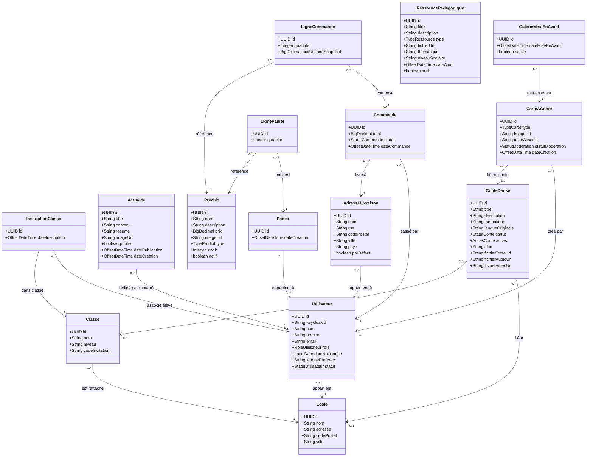
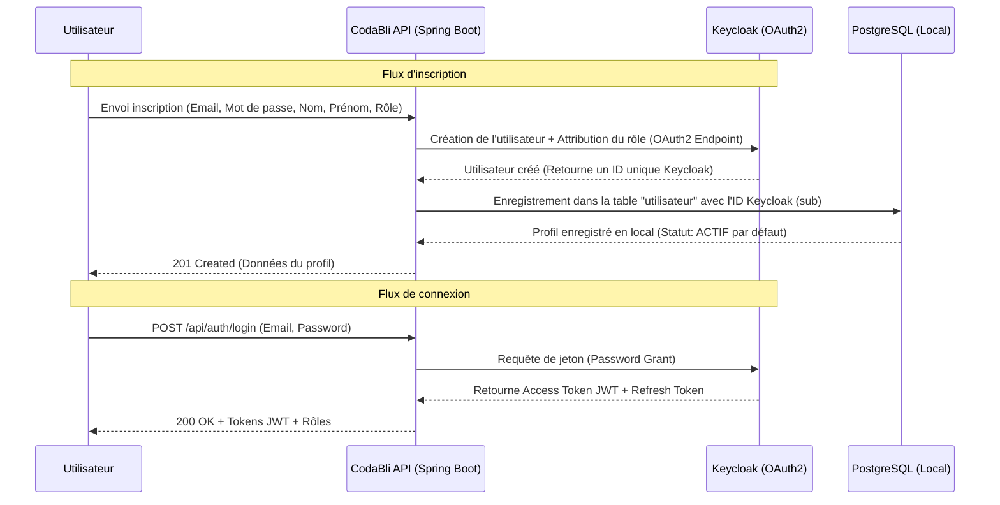
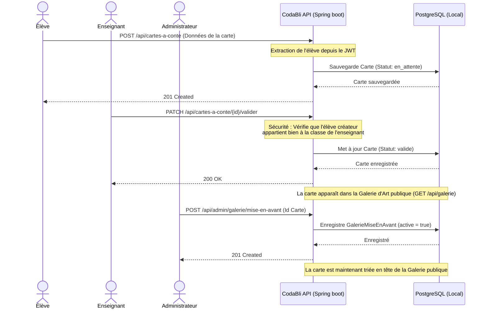
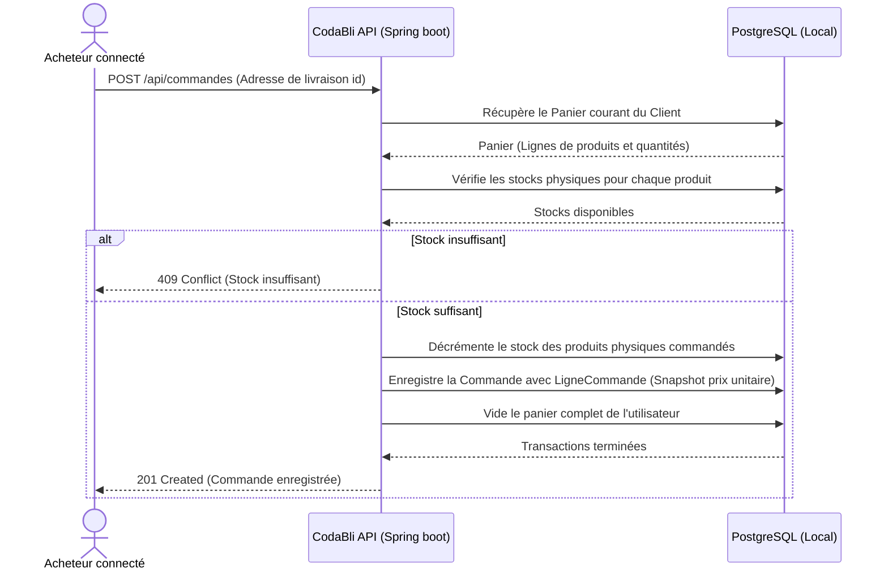

# Guide Fonctionnel Détaillé - Codabli Backend

Ce guide décrit en détail le fonctionnement métier, les flux d'exécution techniques et les interactions entre les différents modules du backend **Codabli**.

---

## 🔐 1. Authentification, Synchronisation & Rôles
Le cycle d'authentification et de gestion des identités est co-géré par le serveur d'autorisation **Keycloak** (Realm `codabli`) et la base de données PostgreSQL de l'application.

* **Création de l'Utilisateur** : Le mot de passe de l'utilisateur n'est jamais stocké dans la base PostgreSQL locale de l'application. Il réside exclusivement et de manière sécurisée dans Keycloak. L'entité locale `Utilisateur` sert uniquement à stocker les informations métiers (comme la date de naissance, la langue préférée et la relation à son école) et à lier les données locales (commandes, panier, cartes).
* **Inscription (`POST /api/auth/register`)** : Crée l'utilisateur dans Keycloak, lui attribue son rôle par défaut, puis l'enregistre en local avec l'identifiant unique Keycloak (champ `sub` du JWT). Par défaut, le compte est créé avec le statut `ACTIF`.
* **Connexion (`POST /api/auth/login`)** : Valide les identifiants de l'utilisateur au niveau de Keycloak et renvoie ses tokens OAuth2 (Access Token JWT et Refresh Token).
* **Gestion du profil (`/me`)** : L'utilisateur connecté peut lire (`GET`) ou mettre à jour (`PUT`) son profil local en fournissant son token JWT dans les en-têtes de la requête.
* **Modération du statut** : Un administrateur peut modifier le statut d'un compte utilisateur (`ACTIF` ➡️ `SUSPENDU` ou `INACTIF`) via l'API d'administration `PATCH /api/admin/utilisateurs/{id}/statut` afin de lui restreindre l'accès à l'application sans détruire ses données historiques.
* **Rôles disponibles** : `eleve`, `enseignant`, `parent`, `professionnel_education`, `admin`, `comite_lecture`, `traducteur`, `ambassadeur`.

---

## 🏫 2. Cycle de Vie Scolaire (Écoles, Classes & Inscriptions)
Ce module gère le rattachement hiérarchique permettant de lier les élèves à des entités éducatives.

* **Création d'une École (`POST /api/ecoles`)** : Enregistrement de l'établissement avec ses informations de localisation (adresse, code postal et ville).
* **Création d'une Classe (`POST /api/classes`)** : Une classe est créée en étant liée à une école existante. Lors de sa création, le système génère systématiquement un **code d'invitation unique** (chaîne aléatoire).
* **Liaison d'un élève à sa classe (`POST /api/inscriptions-classes`)** :
  1. L'élève se connecte avec son jeton JWT.
  2. Il transmet son code d'invitation de classe.
  3. L'application recherche la classe associée au code, vérifie l'absence d'inscription active antérieure pour cet élève, puis l'inscrit dans la table `InscriptionClasse` à la date actuelle.

---

## 📖 3. Contes Dansés & Recherche Globale
Les contes dansés constituent le cœur de la bibliothèque culturelle de l'écosystème Codabli.

* **Création** : Tout utilisateur connecté peut proposer ou créer un conte (`POST /api/contes-danses`). Le conte est initialisé en mode `brouillon`.
* **Cycle de validation** : Le conte peut progresser vers les statuts `en_revision_enseignant` ou `en_revision_comite` avant de passer à `publie` ou `refuse`.
* **Accessibilité publique** : Seuls les contes possédant le statut `publie` sont exposés aux visiteurs anonymes (`GET /api/contes-danses`). Les fichiers médias associés (texte, audio ou vidéo) sont stockés sous forme d'URL Cloud (`imageUrl`, `fichierVideoUrl`...).
* **Gestion d'auteur** : Les modifications (`PUT`) et suppressions (`DELETE`) de contes sont limitées à l'auteur original ou aux administrateurs.
* **Recherche Globale Transversale (`GET /api/recherche?q=...`)** : Un unique endpoint permet d'interroger simultanément deux tables de la base de données : les *Actualités* et les *Contes Dansés*. La recherche JPA est optimisée par des clauses `ContainingIgnoreCase` (recherche partielle de mot-clé insensible aux majuscules/minuscules et accents).

---

## 🃏 4. Cartes à Conte & Galerie d'Art
Il s'agit du parcours d'expression des élèves et de sa valorisation publique.

* **Création** : Un élève conçoit une scène et génère/soumet une carte (`POST /api/cartes-a-conte`). Le système extrait automatiquement son identifiant depuis le JWT pour l'enregistrer comme créateur de la carte. Celle-ci prend le statut `en_attente`.
* **Accessibilité restreinte** :
  * Un élève peut lister uniquement ses propres cartes créées.
  * Un enseignant du réseau scolaire ne voit que les cartes créées par les élèves inscrits dans ses classes.
* **Modération & Validation** : L'enseignant effectue une requête `PATCH /api/cartes-a-conte/{id}/valider`. L'application vérifie si l'auteur de la carte appartient bien à une classe affectée à cet enseignant. Si la vérification réussit, la carte passe au statut `valide`. Sinon, l'accès est bloqué.
* **Publication & Galerie d'Art (`GET /api/galerie`)** : Les cartes validées entrent directement dans la Galerie d'Art publique.
* **Mise en Avant (`GalerieMiseEnAvant`)** : Les administrateurs peuvent ordonner la liste publique pour faire apparaître les cartes mises en avant en tête de liste, suivies des autres cartes validées (trié par date).

---

## 🎒 5. Mallette Pédagogique (Ressources pour Enseignants)
Fournit une bibliothèque de ressources éducatives (fiches, guides de cours, podcasts, vidéos d'exercices) classées par type, thématique ou niveau scolaire.

* **Consultation (`GET`)** :
  * Accessible aux rôles : `enseignant`, `professionnel_education`, `admin` et `comite_lecture`.
  * **Pour les Enseignants & Éducateurs** : Un filtre de sécurité automatique est appliqué en base de données pour qu'ils n'obtiennent que les ressources actives (`actif = true`). Toute tentative de lecture directe (par ID) d'une ressource désactivée renvoie une erreur `AccessDeniedException` (HTTP 403).
  * **Pour les Administrateurs & Comités de lecture** : Ils peuvent consulter toutes les ressources y compris celles désactivées ou en préparation (`actif = false`).
* **Gestion (`POST`/`PUT`)** : La création et la modification de ressources sont réservées au personnel d'encadrement pédagogique : les Administrateurs et le Comité de lecture.
* **Suppression (`DELETE`)** : Action critique réservée exclusivement à l'Administrateur (interdite au comité de lecture).

---

## 🛒 6. Boutique & E-Commerce (Panier, Commandes & Stocks)
Ce module fournit un cycle d'achat classique et robuste (Boutique de livres, objets culturels et contes numériques).

* **Gestion des Articles (`Produit`)** : Types de produits : Physique (ex: livre d'art, cartes physiques) ou Numérique (ex: conte audio téléchargeable). Seuls les produits physiques possèdent un attribut `stock` décrémentable.
* **Panier Personnel (`Panier` & `LignePanier`)** : Chaque panier est strictement privé. La base de données applique une contrainte d'unicité `(panier_id, produit_id)` afin d'éviter les doublons et incrémenter uniquement la quantité lors d'ajouts répétitifs.
* **Processus de Commande (Checkout via `POST /api/commandes`)** :
  1. **Vérification du Stock** : Avant de valider l'achat, l'application bloque le processus si la quantité commandée pour un produit physique dépasse le stock restant (`409 Conflict`).
  2. **Décrémentation** : Diminue automatiquement le stock en base de données.
  3. **Snapshot Prix (Traçabilité Légale)** : Le prix courant du produit est copié dans la ligne de commande (`LigneCommande`). Le prix de la transaction historique est figé et indépendant des futures fluctuations tarifaires.
  4. **Nettoyage** : Le panier de l'utilisateur est entièrement vidé et réinitialisé.
* **Suivi Admin (`/api/admin/commandes`)** : Les factures et expéditions sont gérées par les administrateurs via un changement d'état (ex: de `en_attente` à `payee`, `expediee`, `annulee`).

---

## 📰 7. Actualités (`/api/actualites`)
* **Accès Public** : Lecture des dernières actualités publiées pour toute la communauté.
* **Gestion** : Création, modification et suppression réservées aux administrateurs.

---
---

# 📊 Diagrammes Techniques & Modélisation (Mermaid)

Vous trouverez ci-dessous les codes Mermaid de tous les diagrammes : cas d'utilisation, classes et séquences du système Codabli.

## A. Diagramme de Cas d'Utilisation (Use Case Diagram)
Ce diagramme montre les interactions entre les différents acteurs (Élève, Enseignant, Comité de lecture, Admin, Visiteur public) et les fonctionnalités majeures de l'application.

```mermaid
usecaseDiagram
    actor "Visiteur Public" as Public
    actor "Élève" as Eleve
    actor "Enseignant / Éducateur" as Enseignant
    actor "Comité de Lecture" as Comite
    actor "Administrateur" as Admin

    %% Cas d'utilisations Publics
    hc1("Consulter les Contes Publiés")
    hc2("Consulter la Galerie d'Art")
    hc3("Effectuer une Recherche Globale")
    hc4("Consulter les Actualités")
    hc5("Consulter les Produits Boutique")

    Public --> hc1
    Public --> hc2
    Public --> hc3
    Public --> hc4
    Public --> hc5

    %% Cas d'utilisations Élève
    hc6("S'inscrire dans une Classe (Code)")
    hc7("Créer une Carte à Conte")
    hc8("Gérer son Panier et Commander")

    Eleve --> hc6
    Eleve --> hc7
    Eleve --> hc8
    Eleve --> hc3
    Eleve --> hc1

    %% Cas d'utilisations Enseignant
    hc9("Créer des Ecoles et Classes")
    hc10("Lister & Valider les Cartes de sa Classe")
    hc11("Consulter la Mallette Pédagogique (Actives)")

    Enseignant --> hc9
    Enseignant --> hc10
    Enseignant --> hc11

    %% Cas d'utilisations Comité de Lecture
    hc12("Consulter toutes les Ressources Pédagogiques")
    hc13("Créer & Modifier des Ressources")

    Comite --> hc12
    Comite --> hc13

    %% Cas d'utilisations Admin
    hc14("Gérer les Utilisateurs & Rôles")
    hc15("Mettre en Avant une Carte de la Galerie")
    hc16("Gérer les Produits & Commandes de la Boutique")
    hc17("Supprimer des Ressources Pédagogiques")

    Admin --> hc14
    Admin --> hc15
    Admin --> hc16
    Admin --> hc17
    Admin --> hc13
```

---

## B. Diagramme de Classes des Entités JPA (Class Diagram)
Ce diagramme détaille la modélisation des entités en base de données, leurs attributs et leurs relations.



---

## C. Diagrammes de Séquence

### 1. Inscription, Synchronisation & Connexion Utilisateur
Ce diagramme détaille comment l'API Spring Boot orchestre la création d'utilisateurs avec Keycloak avant de persister le profil local.



---

### 2. Modération et Publication d'une Carte à Conte
Ce diagramme montre le cycle complet d'une carte d'élève, de sa création à sa modération par un enseignant, sa publication dans la Galerie d'Art et sa mise en avant éventuelle par l'administrateur.



---

### 3. Achat & Commande de la Boutique (Checkout)
Ce diagramme détaille les étapes transactionnelles lors du passage de commande, garantissant la cohérence des stocks et la traçabilité des prix historiques.


